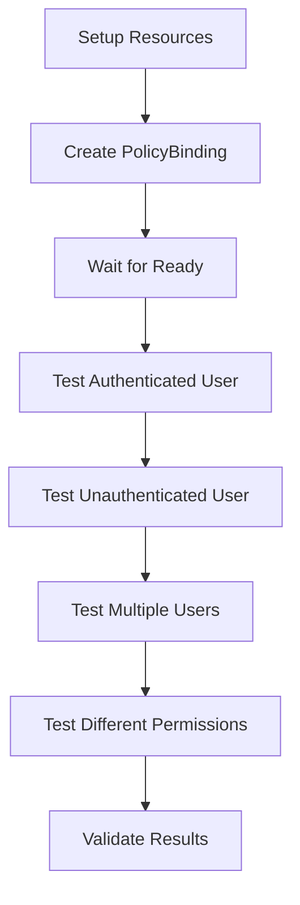

# System Groups End-to-End Test

This directory contains a comprehensive end-to-end test for system groups functionality in PolicyBinding resources using [Chainsaw](https://kyverno.github.io/chainsaw/latest/).

## Overview

System groups (like `system:authenticated-users`) are special groups that represent conceptual user groups rather than explicit IAM resources. Unlike regular groups, they:

- Don't exist as Kubernetes resources
- Don't have UIDs
- Are automatically assigned based on authentication status
- Should work directly in PolicyBinding subjects without validation errors

## Test Implementation

### Test Structure

```
test/iam/system-groups/
├── chainsaw-test.yaml                    # Main Chainsaw test definition
├── protected-resources/
│   └── iam-user.yaml                    # Protected resource for IAM Users
├── roles/
│   └── iam-user-creator.yaml            # Role with user creation permissions
├── test-system-group-policybinding.yaml # Simple PolicyBinding test
├── run-test.sh                          # Test runner script
├── README.md                            # Basic documentation
└── SYSTEM_GROUPS_E2E_TEST.md           # This comprehensive guide
```

### Test Scenarios

The test validates the following scenarios:

#### 1. **Setup Phase**
- Creates necessary protected resources for IAM User management
- Creates a role with user creation and read permissions
- Waits for all resources to be ready

#### 2. **PolicyBinding Creation**
- Creates a PolicyBinding that binds `system:authenticated-users` to the user creator role
- **Key validation**: No UID is required for system groups
- Uses `resourceKind` selector to apply to all User resources
- Waits for the PolicyBinding to become ready

#### 3. **Positive Access Test**
- Tests that a user with `system:authenticated-users` group gets access
- Sends SubjectAccessReview request with groups: `["system:authenticated-users", "system:authenticated"]`
- Verifies the authorization webhook allows the CREATE operation

#### 4. **Negative Access Test**
- Tests that a user without the system group is denied access
- Sends SubjectAccessReview request with groups: `["system:unauthenticated"]`
- Verifies the authorization webhook denies the CREATE operation

#### 5. **Multiple Users Test**
- Tests another authenticated user to ensure system groups work for multiple users
- Uses different user identity but same system groups
- Includes additional custom groups to test group handling

#### 6. **Multiple Permissions Test**
- Tests that system groups work for different permissions (GET vs CREATE)
- Verifies the role's included permissions are properly enforced

## Implementation Details

### Changes Validated

The test validates the following implementation changes:

1. **PolicyBinding Controller** (`auth-provider-openfga/internal/controller/policybinding_controller.go`)
   - Modified `validatePolicyBindingSubjects` to skip UID validation for system groups
   - System groups (names starting with `system:`) are always considered valid

2. **OpenFGA Policy Reconciler** (`auth-provider-openfga/internal/openfga/policy_reconciler.go`)
   - Updated `getTupleUser` function to handle system groups
   - System groups use the group name directly instead of requiring UID resolution

3. **Authorization Webhooks** (`auth-provider-openfga/internal/webhook/`)
   - Both core and project authorizers add group contextual tuples
   - Extract groups from user info using `attributes.GetUser().GetGroups()`
   - Create contextual tuples for system groups in OpenFGA checks

### Test Execution Flow



### Authorization Webhook Testing

The test makes HTTP requests to the authorization webhook at:
```
https://auth-provider-openfga-authz-webhook.auth-provider-openfga-system.svc.cluster.local:8090/core/v1alpha/webhook
```

Each request includes:
- **User identity**: Different test users
- **Groups**: Various combinations including system groups
- **Resource attributes**: IAM User resources with different verbs

Expected responses:
- **Authenticated users**: `"allowed": true`
- **Unauthenticated users**: `"allowed": false`

## Running the Test

### Prerequisites

1. **Chainsaw installed**: Follow [installation guide](https://kyverno.github.io/chainsaw/latest/)
2. **Kubernetes cluster**: With auth-provider-openfga deployed
3. **System groups implementation**: All code changes applied

### Execution Options

#### Option 1: Using the test runner script
```bash
cd test/iam/system-groups/
./run-test.sh
```

#### Option 2: Direct Chainsaw execution
```bash
cd auth-provider-openfga/
chainsaw test test/iam/system-groups/
```

#### Option 3: Run all IAM tests
```bash
cd auth-provider-openfga/
chainsaw test test/iam/
```

### Expected Output

Successful test execution should show:
- ✅ All setup steps complete
- ✅ PolicyBinding created and ready
- ✅ Authenticated users get access
- ✅ Unauthenticated users denied access
- ✅ Multiple users and permissions work correctly

## Troubleshooting

### Common Issues

1. **PolicyBinding fails to create**
   - Check if system groups implementation is deployed
   - Verify CRDs are installed and controllers are running

2. **Webhook tests fail**
   - Ensure auth-provider-openfga is deployed in the cluster
   - Check webhook service is accessible
   - Verify webhook certificates are valid

3. **Access tests give unexpected results**
   - Check OpenFGA tuples are created correctly
   - Verify group contextual tuples are being added
   - Review webhook logs for authorization decisions

### Debug Commands

```bash
# Check PolicyBinding status
kubectl get policybinding system-authenticated-users-binding -o yaml

# Check webhook pod logs
kubectl logs -n auth-provider-openfga-system deployment/auth-provider-openfga-controller-manager

# Check test pod logs
kubectl logs authenticated-user-test
kubectl logs unauthenticated-user-test
```

## Validation Checklist

After running the test, verify:

- [ ] PolicyBinding created without UID validation errors
- [ ] System groups processed correctly in OpenFGA tuples
- [ ] Authorization webhook adds group contextual tuples
- [ ] Authenticated users get appropriate access
- [ ] Unauthenticated users are properly denied
- [ ] Multiple users and permissions work consistently

## Integration with CI/CD

This test can be integrated into CI/CD pipelines:

```yaml
# Example GitHub Actions step
- name: Run System Groups E2E Test
  run: |
    cd auth-provider-openfga/test/iam/system-groups/
    ./run-test.sh
```

The test is designed to be deterministic and should pass consistently in automated environments.

## Related Documentation

- [System Groups Implementation](../../../SYSTEM_GROUPS_IMPLEMENTATION.md)
- [Chainsaw Documentation](https://kyverno.github.io/chainsaw/latest/)
- [PolicyBinding API Reference](../../../docs/api/)
- [Authorization Webhook Guide](../../../docs/authorization/)
